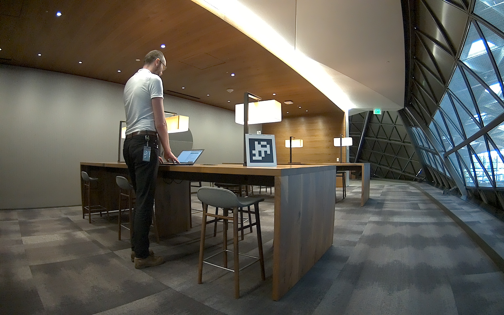
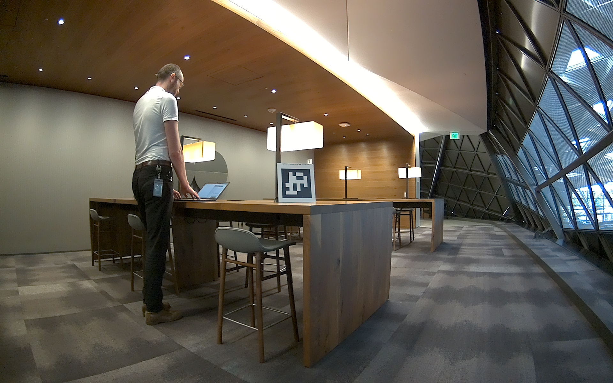

# Isaac ROS Argus Camera

<div align="center"></div>

This repository provides monocular and stereo nodes that enable ROS developers to use cameras connected to Jetson platforms over a CSI interface. The nodes internally use libargus, which is an API for acquiring images and associated metadata from camera devices.

[Libargus API reference](https://docs.nvidia.com/jetson/l4t-multimedia/group__LibargusAPI.html)

This package is compatible with ROS2 Foxy and has been tested on the Jetson platfrom with off-the-shelf cameras from NVIDIA partners(see the **Reference Camera** section for more details). **Note**: x86_64 is not supported.

## System Requirements
The CSI camera device needs to be connected and running and to present the video device node (e.g. /dev/video0).

### Jetson
- [Jetson AGX Xavier and NX Xavier](https://www.nvidia.com/en-us/autonomous-machines/embedded-systems/)
- [JetPack 4.6](https://developer.nvidia.com/embedded/jetpack)

**Note:** For best performance on Jetson, ensure that power settings are configured appropriately ([Power Management for Jetson](https://docs.nvidia.com/jetson/l4t/index.html#page/Tegra%20Linux%20Driver%20Package%20Development%20Guide/power_management_jetson_xavier.html#wwpID0EUHA)).

### Docker
Precompiled ROS2 Foxy packages are not available for JetPack 4.6 (based on Ubuntu 18.04 Bionic). You can either manually compile ROS2 Foxy and required dependent packages from source or use the Isaac ROS development Docker image from [Isaac ROS Common](https://github.com/NVIDIA-ISAAC-ROS/isaac_ros_common).

You must first install the [Nvidia Container Toolkit](https://docs.nvidia.com/datacenter/cloud-native/container-toolkit/install-guide.html) to make use of the Docker container development/runtime environment.

Configure `nvidia-container-runtime` as the default runtime for Docker by editing `/etc/docker/daemon.json` to include the following:
```
    "runtimes": {
        "nvidia": {
            "path": "nvidia-container-runtime",
            "runtimeArgs": []
        }
    },
    "default-runtime": "nvidia"
```
and then restarting Docker: `sudo systemctl daemon-reload && sudo systemctl restart docker`

Run the following script in `isaac_ros_common` to build the image and launch the container:

`$ scripts/run_dev.sh <optional path>`

You can either provide an optional path to mirror in your host ROS workspace with Isaac ROS packages, which will be made available in the container as `/workspaces/isaac_ros-dev`, or you can setup a new workspace in the container.

### Reference Camera
NVIDIA has worked with our camera partners to provide the modules listed below which are compatible with the Isaac ROS Argus Camera packages.


| Camera Type            | Connector | Resolution/FrameRate | H/V FOV | Shutter | Supplier, HW Part, Link to purchase                                                                                                                                        | Driver                                                                                                  |
| ---------------------- | --------- | -------------------- | ------- | ------- | -------------------------------------------------------------------------------------------------------------------------------------------------------------------------- | ------------------------------------------------------------------------------------------------------- |
| Stereo Camera/Color    | GMSL      | 1920x1200@60fps      | 121/73  | Global  | [LI-AR0234CS-STEREO-GMSL2](https://www.leopardimaging.com/product/autonomous-camera/maxim-gmsl2-cameras/li-ar0234cs-stereo-gmsl2/li-ar0234cs-stereo-gmsl2/)                | [Latest Driver](https://github.com/LPXingxing/LI-AR0234CS-STEREO-GMSL2)                                 |
| Fisheye Camera/Color   | GMSL      | 1920x1200@60fps      | 202/127 | Global  | [LI-AR0234CS-GMSL2-OWL](https://www.leopardimaging.com/product/autonomous-camera/maxim-gmsl2-cameras/li-ar0234cs-gmsl2-owl/li-ar0234cs-gmsl2-owl/)                         | [Latest Driver](https://github.com/LPXingxing/LI-AR0234CS-GMSL2-OWL)                                    |
| Monocular Camera/Color | GMSL      | 4056x3040@60fps      | 140/103 | Rolling | [LI-IMX477-MIPI-140H](https://www.leopardimaging.com/product/csi-2-mipi-modules-i-pex/csi-2-mipi-modules/rolling-shutter-mipi-cameras/12-33mp-imx477/li-imx477-mipi-140h/) | [Latest Driver](https://github.com/LPXingxing/LI-IMX477-MIPI-140H)                                      |
| Monocular Camera/Color | CSI       | 1920x1080@60fps      | 79/64   | Rolling | [D3CM-IMX390 CAMERA MODULE](https://www.d3engineering.com/product/designcore-d3cm-imx390-camera-module/)                                                                   | [Latest Driver](https://github.com/D3Engineering/d3-jetson-bsp/releases/tag/D3%2FRELEASE%2F5.0.0-pre.3) |
| Monocular Camera/Color | CSI       | 4056x3040@60fps      | 186/186 | Rolling | [FSM-IMX412C](https://www.framos.com/en/products/fsm-imx412c-txa-devkit-single-v1b-25821)                                                                                  | Product Kit contains driver link                                                                        |


## Quickstart
1. Create a ROS2 workspace if one is not already prepared:  
`mkdir -p your_ws/src`  
**Note:** The workspace can have any name; this guide assumes you name it `your_ws`.

2. Clone the Isaac ROS Argus Camera repository to `your_ws/src/isaac_ros_argus_camera`. Check that you have [Git LFS](https://git-lfs.github.com/) installed before cloning to pull down all large files.  
`sudo apt-get install git-lfs`  
`cd your_ws/src && git clone https://github.com/NVIDIA-ISAAC-ROS/isaac_ros_argus_camera`

3. Build and source the workspace:  
`cd your_ws && colcon build --symlink-install && source install/setup.bash`

4. (Optional) Run tests to verify complete and correct installation:  
`colcon test`

5. Launch the node:  
`ros2 run isaac_ros_argus_camera_mono isaac_ros_argus_camera_mono --ros-args -p device:=0 -p sensor:=0 -p output_encoding:="mono8"`


## Package Reference
### isaac_ros_argus_camera_mono

`ros2 run isaac_ros_argus_camera_mono isaac_ros_argus_camera_mono --ros-args -p device:=<device_index> -p sensor:=<sensor_index> -p output_encoding:=<encoding_string>`
  
| ROS Argument      | Usage                                                                  |
| ----------------- | ---------------------------------------------------------------------- |
| `device_index`    | The video node index (e.g. `/dev/video0`)                              |
| `sensor_index`    | The sensor mode supported by the camera sensor and driver              |
| `output_encoding` | The output image format.  `mono8 ` and `rgb8 ` are currently supported |
| `camera_info_url` | URL for camera info YAML file which overrides Argus Ext calibration parameter if specified (e.g. `file:///home/admin/.ros/camera_info/camerav2.yml`) |


### isaac_ros_argus_camera_stereo

   `ros2 run isaac_ros_argus_camera_stereo isaac_ros_argus_camera_stereo --ros-args -p device:=<device_index> -p sensor:=<sensor_index> -p output_encoding:=<encoding_string>`

| ROS Argument      | Usage                                                                 |
| ----------------- | --------------------------------------------------------------------- |
| `device_index`    | The first video node index (e.g. `/dev/video0`)                       |
| `sensor_index`    | The sensor mode supported in the camera sensor and driver             |
| `output_encoding` | The output image format. `mono8 ` and `rgb8 ` are currently supported |

**Note**: To run the stereo node, two video nodes should present for left and right sensors, respectively (e.g. `/dev/video0` and `/dev/video1`).

Examples:  
`ros2 run isaac_ros_argus_camera_mono isaac_ros_argus_camera_mono --ros-args -p device:=0 -p sensor:=0 -p output_encoding:="rgb8"`

`ros2 run isaac_ros_argus_camera_stereo isaac_ros_argus_camera_stereo --ros-args -p device:=0 -p sensor:=0 -p output_encoding:="mono8"`

To view the output images:  
  
 `ros2 run image_view image_saver --ros-args -r image:=/image_raw -p filename_format:="right_image.jpg" `

 `ros2 run image_view image_saver --ros-args -r image:=/stereo/left/image_raw -p filename_format:="left_image.jpg" `

### CameraInfo Message
Argus nodes use the Argus Ext API to retrieve calibration parameters from the camera through the Linux device driver and convert it to [`CameraInfo`](http://docs.ros.org/en/melodic/api/sensor_msgs/html/msg/CameraInfo.html) messages.  
Refer to [link](https://docs.nvidia.com/jetson/l4t-multimedia/classArgus_1_1Ext_1_1ISyncSensorCalibrationData.html) for the data structure of the calibration parameters. 

**Note**: Each camera module should have stored the calibration parameters in the internal memory like EEPROM and the device driver supports the API to extract it. Contact your camera vendor to get the driver that supports it.

If your camera does not support the Argus Ext API, you can also specify a URL to a camera info YAML file parseable by ROS [CameraInfoManager](http://wiki.ros.org/camera_info_manager) using the `camera_info_url` parameter on the `isaac_ros_argus_camera_mono` node. This will allow you to provide parameters you may have calibrated using the ROS [Camera Calibration](http://wiki.ros.org/camera_calibration) package, for example.

**Note**: The `camera_info_url` parameter is only available on the `isaac_ros_argus_camera_mono` node at present.

## Troubleshooting
### Argus camera nodes could stop publishing images sometimes when used with 4K high-resolution cameras in certain graph configurations on FastRTPS
With downstream subscribers that are not able to process images at the camera frame rate, we have observed instances where the Argus camera node suddenly stops publishing new images after about 15-20 minutes.

#### Solution
We are continuing to collect data and diagnose the issue but changing the QoS settings to "Best Effort" and using a smaller frame size seem to alleviate the condition.

# Updates

| Date       | Changes         |
| ---------- | --------------- |
| 2021-10-20 | Initial release |
